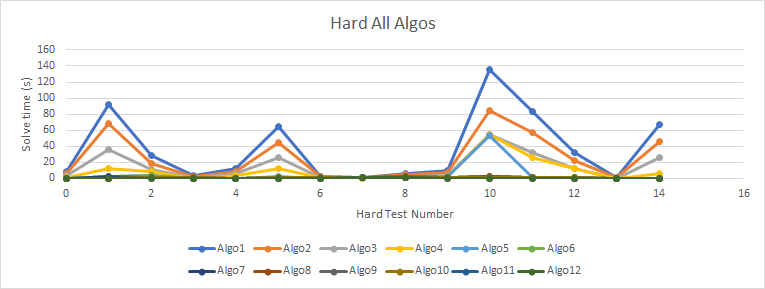
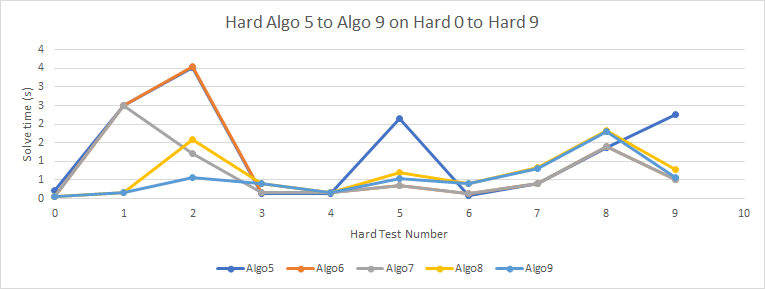
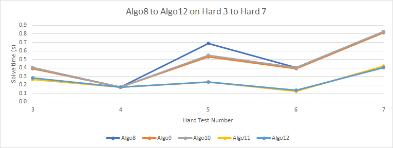
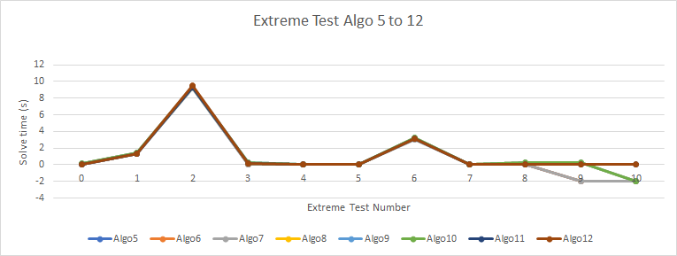

# Summary
The activity scope was to develop an AI that can solve 9x9 Sudoku puzzles or to determine that the puzzle may not be solved in the shortest time possible

The final solution is a solver that utilises the following algorithms:  
Step 1: Iterate till no improvement is achieved using Hidden Singles and Naked Pairs.
Step 2: Is a Backtracking Depth-First Search (BDFS) which follows a psuedo Greedy-first search (it picks the row with the least empty nodes). However if a puzzle has only 26 clues or less, the sequence is top left to top right, and then moving down the rows. The choice of 26 was empirically selected from the sample tests used. Other methods were considered - such as selecting the nodes with the least possible options, however this was also not universally advantage in the even that the first node would be in the top left corner the next would be the bottom right.  

There were other methods adopted and later eliminated. In addition to the provided test cases, an additional set of 11 test cases were considered, referred to as "extreme" (the data has been provided as a numpy file). In the particular, the set contained two unsolvable puzzles which exposed limitations that could not be recognised by the pre-provided tests. Therefore towards the final stages of optimisation, some speed algorithmic improvments were eliminated in order to retain what is considered to be a more successful result against the mentioned troublesome extreme test cases.

# Introduction
The scope of this work is to implement an agent that can solve sudoku puzzles. The algorithm would be evaluated by automated testing, and thus will be tested against unknown sudoku puzzles. The activity scope was to develop an AI that can solve 9x9 Sudoku puzzles or to determine that the puzzle may not be solved in the shortest time possible, however the weighting and exact evaluation criteria were unknown.
 
# Coding Approaching
Optimization and data structures was done following the approach of:
```
"Make it work first, Work from the user's point of view, Keep the code readable" and to avoid the common mistake of optimizing code while still writing it. 
    (Jaworski, 2016, chapter 11)  
```  
Once the agent could solve all provided puzzles, the code was developed to solve tougher puzzles before being optimised

## Algorithmic Optimization

This meant, initially major improvements for speeding up the core algorithms, such as the utilization of a empty-cell list and a dictionary containing options for each emtpy cell to focus down the search of the Backtracking Depth-First Search (BDFS).

Later implementing advanced solving or field pre-filtering algorithms such as hidden singles and naked pairs.

Introductions algorithms aimed at detecting unsolvable puzzles by:
- Detecting if there are any doubles in a unit (row/column/3x3 box)
- Detecting if according to the pre-listed optional optional values for each cell could result in a solution that would ensure at least 1 value of each number in each row/column/3x3 box.

And a hidden pairs method was introduced (which is not being employed to solve the puzzle), but rather to expose unsolvable puzzles that have too many options to solve. This method is similar to that which (Sinai, 2020) describes. The puzzle described is one that has 2 cells haked the same perfect naked triples - meaning those 3 numbers may only be in those three cells. Using the naked pairs algorithm, it exposes the flaw of the puzzle which can be then recognised by allowing the BDFS or the detection method pick-it up.
Since the detection method consumes times that would not be needed for solvable puzzles, whereas the BDFS would always be needed for not yet solved puzzles, the BDFS method was selected.


## Code Optimization Considered
The instructions required the use of a function with a sudoku puzzle (a numpy array) passed to it as a parameter. The test script provided also iterated through the puzzles proceduraly. This influenced the idea of keeping with procedural / function based code.
```python
sudoku_solver(sudoku)
```

It might be that using OOP or using global variables (to try and replicate the passing of pointers to different functions) might be faster or slower, but this is likely to be a factor for the hardware and limitations of Python. In public domain exist sudoku solvers that utilise binary bitwise logic is performed such as the work of Jin (2014). All of these mentioned factors were not considered for this development.

Instead consideration on how to reduce list-regeneration, such as:
```python
def scan_options(sudoku, range_cells):
    full_opt = get_options_full(sudoku)
    first_cell, last_cell = range_cells
    scanned = set()
    for y in range(first_cell[0], last_cell[0] + 1):
        for x in range(first_cell[1], last_cell[1] + 1):
            sub_opt = set(full_opt[y, x])
            scanned = scanned | sub_opt
    return scanned
```

Was modified to now rebuild a base option

```python
def scan_options(options, range_cells):
    first_cell, last_cell = range_cells
    scanned = set()
    for y in range(first_cell[0], last_cell[0] + 1):
        for x in range(first_cell[1], last_cell[1] + 1):
            sub_opt = set(options[y, x])
            scanned = scanned | sub_opt
    return scanned
```    

Removing such avoidable sub-routines delivered a 50% performance boost on most tests. 

In the last optimization round, some routines such as that of hidden-pairs and naked-pairs was converted to utilise Python sets rather than Lists. This seems to make no detectable speed impact, however the changes were kept because it improved code readability.

The final touch was hand writing variables to perform as constants. An example of this is the pair searches. A list of sets was defined to prevent any overhead from generating the list:  
```python
sub_sets = [{1, 2}, {1, 3}, {1, 4}, {1, 5}, {1, 6}, {1, 7}, {1, 8}, {1, 9},
            {2, 3}, {2, 4}, {2, 5}, {2, 6}, {2, 7}, {2, 8}, {2, 9}, {3, 4}, 
            {3, 5}, {3, 6}, {3, 7}, {3, 8}, {3, 9}, {4, 5}, {4, 6}, {4, 7}, 
            {4, 8}, {4, 9}, {5, 6}, {5, 7}, {5, 8}, {5, 9}, {6, 7}, {6, 8}, 
            {6, 9}, {7, 8}, {7, 9}, {8, 9}]
```


# Algorithm Selection
Over 20 algorithms variations were considered, but the main ones are reviewed here. One significant challenge during the evolution of this code was that of detecting unsolvable puzzles. The backtracking depth-first search was able to detect the original test cases.
However, after introducing rule-based constraints to reduce the problem field,

1. Pure raw Backtracking Depth-First Search (BDFS).
2. Same as (1) but with a pre-constructed list of where the 0's are.
3. Same as (2) but with a pre-constructed list of all the possible values for each 0 location by considered the rules of row / column / sub-box.
4. Same as (3) but also searching for hidden singles first.
5. Same as (4) but after solving looping the process repeat until ([find hidden singles] -> [solve naked singles]) until there are no improvements to the board, then moving to BDFS.
6. Same as (5) but searching for hidden singles and naked pairs instead.
7. Same as (6) but searching for hidden singles and naked triples instead (not a true triple implementation because it only searches for cells with exactly 3 possibilities and occuring exactly 3 times in a row or column only).
8. Same as (7) but after the initial hidden singles / triple loops, the sudoku is checked for compliance with 3 rules:  
        - that all rows / columns / boxes have no more than 1 occurance of a digit from 1..9  
        - that all rows / columns / boxes have the possibility of containing 1 of each digit (either because it is already assigned or because it is part of the options/"pencil" values).  
    The reason this was introduced is that there are some documented unsolvable puzzles that take very long by most solvers (Sinai, 2020). 
9. Same as (8) but with an additional optimization for the BDFS for puzzles with more than 26 fixed cells (26 clues).  
Rather then checking the cells purely sequentially (from cell 0,0) a weighting is given to the rows. Then the BDFS would start from that row till the bottom of the puzzle then wrap to the top row. It was considered to also prioritise solving by column sequence (but this did not produce any speed benefits in the test cases). This slow down was not investigated.  
The choice of 26 was emperically determined and may cause issues on other puzzles.
10. Same as (9) however with the naked pair algorithm instead of the unique naked triple.
11. A partial hidden pair algorithm was introduced and elimination of certain for-loops by improving function algorithm and parameters passed.
12. A full hidden pair implementation and robustness improvement at detecting unsolvable puzzles.
          
The tests, results and analyses of the results are described here.

# Test Cases
The tests were conducted on the provided very_easy to hard puzzles. In addition a set of 12 puzzles were compiled - referred to as "extreme". 

0. An evil type (ExtremeSudoku, 2021)  
1. A Arto Inkala puzzle (ExtremeSudoku, 2021 and Sinai, 2020)  
2. A 'Shinning Mirror' puzzle (ExtremeSudoku, 2021 and Sinai, 2020)  
3. An evil type (ExtremeSudoku, 2021)  
4. A 17-clue (Sinai, 2020)
5. A hole (Marion, 2019)
6. A killer application (Marion, 2019)  
7. A self made puzzle with intentional doubles (Cannot be solved)
8. A self made puzzle with only 2 clues (theoratically out of scope of the task, but solvable)
9. An impossible (no solution) to solve puzzle (Sinai, 2020)
10. An impossible (no solution) to solve puzzle (Sinai, 2020)


## Results Hard
| Hard | X | Algo1  | Algo2 | Algo3 | Algo4 | Algo5 | Algo6 | Algo7 | Algo8 | Algo9 | Algo10 | Algo11 | Algo12 |
|------|---|--------|-------|-------|-------|-------|-------|-------|-------|-------|--------|--------|--------|
| 0    | X | 7.98   | 5.88  | 2.94  | 1.36  | 0.22  | 0.05  | 0.05  | 0.05  | 0.05  | 0.05   | 0.06   | 0.08   |
| 1    | X | 92.36  | 68.41 | 36.30 | 12.67 | 2.50  | 2.50  | 2.50  | 0.17  | 0.17  | 0.17   | 0.09   | 0.09   |
| 2    |   | 28.20  | 18.64 | 11.53 | 7.98  | 3.52  | 3.55  | 1.22  | 1.58  | 0.56  | 0.61   | 0.17   | 0.23   |
| 3    |   | 3.52   | 2.64  | 1.44  | 0.31  | 0.14  | 0.16  | 0.17  | 0.41  | 0.39  | 0.41   | 0.27   | 0.28   |
| 4    |   | 12.61  | 8.78  | 5.55  | 2.97  | 0.14  | 0.17  | 0.16  | 0.17  | 0.17  | 0.17   | 0.17   | 0.17   |
| 5    |   | 63.95  | 44.27 | 26.38 | 12.58 | 2.16  | 0.36  | 0.36  | 0.69  | 0.53  | 0.55   | 0.23   | 0.23   |
| 6    |   | 2.27   | 1.72  | 0.92  | 0.61  | 0.08  | 0.13  | 0.14  | 0.41  | 0.39  | 0.41   | 0.13   | 0.14   |
| 7    |   | 0.88   | 0.58  | 0.34  | 0.36  | 0.39  | 0.41  | 0.41  | 0.83  | 0.81  | 0.83   | 0.42   | 0.41   |
| 8    |   | 6.56   | 4.52  | 2.45  | 1.36  | 1.36  | 1.41  | 1.41  | 1.83  | 1.81  | 1.81   | 1.39   | 1.42   |
| 9    |   | 9.70   | 6.94  | 3.86  | 2.59  | 2.25  | 0.50  | 0.50  | 0.78  | 0.56  | 0.56   | 0.30   | 0.28   |
| 10   |   | 135.80 | 84.83 | 54.69 | 54.47 | 53.14 | 1.86  | 1.83  | 2.28  | 0.95  | 0.97   | 0.23   | 0.23   |
| 11   |   | 83.55  | 56.95 | 32.03 | 25.41 | 0.44  | 0.47  | 0.47  | 0.75  | 0.50  | 0.52   | 0.23   | 0.25   |
| 12   | X | 32.42  | 22.44 | 11.88 | 11.86 | 0.47  | 0.25  | 0.27  | 0.44  | 0.44  | 0.44   | 0.28   | 0.28   |
| 13   | X | 0.58   | 0.50  | 0.28  | 0.31  | 0.14  | 0.25  | 0.23  | 0.23  | 0.23  | 0.23   | 0.25   | 0.25   |
| 14   | X | 67.25  | 46.30 | 26.27 | 6.58  | 0.03  | 0.05  | 0.06  | 0.05  | 0.05  | 0.06   | 0.03   | 0.05   |

- Times shown in seconds
- X indicates puzzles that do not have a solution

## Results Extreme
| Extreme | X | Algo1   | Algo2   | Algo3  | Algo4  | Algo5 | Algo6 | Algo7 | Algo8 | Algo9 | Algo10 | Algo11  | Algo12 |
|--------:|--:|---------|---------|--------|--------|-------|-------|-------|-------|-------|--------|---------|--------|
|       0 |   |    0.50 |    0.38 |   0.20 |   0.17 |  0.06 |  0.06 |  0.06 |  0.14 |  0.14 |   0.14 | 0.08    | 0.08   |
|       1 |   |    3.11 |    2.20 |   1.25 |   1.30 |  1.27 |  1.27 |  1.28 |  1.42 |  1.41 |   1.42 | 1.33    | 1.33   |
|       2 |   |   22.00 |   16.02 |   9.36 |   9.31 |  9.30 |  9.36 |  9.17 |  9.36 |  9.36 |   9.34 | 9.28    | 9.47   |
|       3 |   |    0.11 |    0.08 |   0.05 |   0.02 |  0.02 |  0.03 |  0.03 |  0.11 |  0.20 |   0.20 | 0.14    | 0.13   |
|       4 |   | 1538.17 | 1141.41 | 640.58 | 634.34 |  0.06 |  0.06 |  0.08 |  0.08 |  0.06 |   0.06 | 0.09    | 0.09   |
|       5 |   |    1.27 |    1.11 |   0.63 |   0.55 |  0.06 |  0.05 |  0.05 |  0.05 |  0.05 |   0.06 | 0.06    | 0.06   |
|       6 |   |    7.42 |    5.44 |   3.13 |   3.09 |  3.09 |  3.17 |  3.06 |  3.28 |  3.19 |   3.25 | 3.16    | 3.14   |
|       7 | X |    0.36 |    0.28 |   0.14 |   0.13 |  0.02 |  0.02 |  0.02 |  0.03 |  0.02 |   0.03 | 0.03    | 0.03   |
|       8 |   |    0.03 |    0.02 |   0.03 |   0.05 |  0.05 |  0.05 |  0.05 |  0.30 |  0.30 |   0.30 | 0.08    | 0.08   |
|       9 | X |   -2.00 |   -2.00 |  -2.00 |  -2.00 | -2.00 | -2.00 | -2.00 |  0.22 |  0.22 |   0.23 | 0.05    | 0.05   |
|      10 | X |   -2.00 |   -2.00 |  -2.00 |  -2.00 | -2.00 | -2.00 | -2.00 | -2.00 | -2.00 |  -2.00 | 0.03 | 0.03   |

- Times shown in seconds
- X indicates puzzles that do not have a solution
- Negative times are solves that were terminatedabo due to some arbitrary time limit.  

# Algorithm Evolution
The BDFS approach was able to solve all hard puzzles including the unsolvable ones. However there seemed to be no relation to whether the puzzle was solvable or not. Retrospective testing on the Extreme puzzles show that the method is extremely slow to solve Extreme-4.

Algo1 to Algo4 delivered significant speed improvement on Hard-1, Hard-5 and Hard-10 as show in the following graph:
  
  
Algo5 to Algo7 focused on iteration of algorithms before switching to the BDFS approach. This created some overheard to some puzzles that did not need the iteration, however it still delivered mostly a peformance increase on most puzzles as shown in the following graph:  
  

As more complex algorithms were introduced, some issues were introduced - often the unsolvable puzzles caused issues. Therefore more and more defencing considerations had to be added.  
In fact there is uncertainty on the robustness of the Algo7 (on which Algo8 and 9 are based). However Algo7 made a significant speed gain on the test Hard-3. However, this speed gain is overshadowed by improvements gained the changes made in Algo9, and in fact the final solution is within 10ms of Algo9.  

The final optisation and improvement efforts from Algo8 to Algo12 achieved a signficant further 50% improvement (of a relatively low solving time) as show in the following graph:  

  
The optimisation employed in Algo5 to Algo12 did not generate any major speed benefit in Extreme as shown in the following graph. However they solved the issue of achieving the desired result for Extreme-9 and Extreme-10 (the unsolvable puzzles included in this appendix).  The negative values imply it could not be solved in the allowed (approximately 60 minutes).


# Reflection
There were 2 significant challenges discovered. That of speeding up the solving time for puzzles that can be solved, while simultaneously trying to quit the solve attempt for an unsolvable puzzle.  

In that sense, the "decision-making" seemed more challenging to code than the "problem-solving" because the problem was not always to "solve the puzzle" but also to know when to quit.


# References / Bibliography
- ExtremeSudoku, 2021. _Extreme Sudoku - Difficult Sudoku Puzzles and Solver_ [Online]. Available from: https://www.extremesudoku.info/privacy.html [Accessed 16 May 2021].
- Jaworski, M., 2016. _Expert Python programming : become an ace Python programmer by learning best coding practices and advance-level concepts with Python 3.5_ [Online]. Second edition. Community experience distilled. Birmingham: Packt Publishing. Available from: https://learning.oreilly.com/library/view/expert-python-programming/9781785886850/ch11.html [Accessed 16 May 2021].
- Jin, K., 2014. _sudoku-solver_ [Online]. Available from: https://github.com/dianjin/sudoku-solver [Accessed 16 May 2021].
- Marion, B.J., 2019. _MarionBarbee/Sudoku_solver: Solves all the world's hardest Sudoku puzzles including all from Dr. Arto Inkala, U of Helsinki (Professor of Mathematics)._ [Online]. Available from: https://github.com/MarionBarbee/Sudoku_solver [Accessed 16 May 2021].
- Sinai, L., 2020. _Sudoku Solver_ in Python.
- Stuart, A., 2019. _Sudoku Solver by Andrew Stuart_ [Online]. Available from: https://www.sudokuwiki.org/sudoku.htm [Accessed 16 May 2021].


# Appendix
```python
([
    [0, 0, 0, 0, 0, 0, 0, 0, 0],
    [0, 0, 0, 0, 0, 0, 0, 0, 0],
    [0, 0, 0, 0, 0, 0, 0, 0, 0],
    [0, 0, 0, 1, 2, 0, 0, 0, 0],
    [0, 0, 0, 3, 4, 0, 0, 0, 0],
    [0, 0, 0, 0, 0, 0, 5, 0, 0],
    [0, 0, 0, 0, 0, 5, 0, 0, 0],
    [0, 0, 0, 0, 0, 0, 0, 0, 0],
    [0, 0, 0, 0, 0, 0, 0, 0, 0]])
```
(Sinai, 2020)

```python
([
    [0, 0, 0, 0, 0, 5, 0, 8, 0],
    [0, 0, 0, 6, 0, 1, 0, 4, 3],
    [0, 0, 0, 0, 0, 0, 0, 0, 0],
    [0, 1, 0, 5, 0, 0, 0, 0, 0],
    [0, 0, 0, 1, 0, 6, 0, 0, 0],
    [3, 0, 0, 0, 0, 0, 0, 0, 5],
    [5, 3, 0, 0, 0, 0, 0, 6, 1],
    [0, 0, 0, 0, 0, 0, 0, 0, 4],
    [0, 0, 0, 0, 0, 0, 0, 0, 0]])
```
(Sinai, 2020)